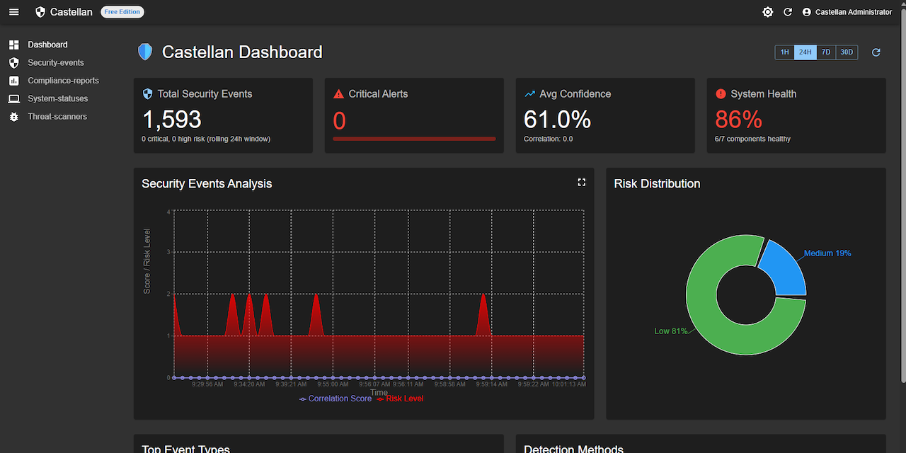

```mermaid
flowchart LR
    A[Windows Event Logs] --> B[Castellan Worker Service]
    B --> C[Parallel AI/ML Processing]
    C --> D[Qdrant Vector Database]
    B --> K[SQLite Database]
    B --> E[Notification Services]
    E --> F[Desktop Notifications]
    E --> G[Web Admin Interface]
    E --> M[Teams/Slack Channels]
    D --> H[Vector Search & Correlation]
    K --> L[Application & MITRE Data]
    H --> I[Threat Detection Engine]
    I --> J[Security Alerts]
    J --> E
    L --> I
    
    subgraph "Data Collection"
        A
    end
    
    subgraph "Core Processing"
        B
        C
    end
    
    subgraph "Data Storage"
        D
        K
    end
    
    subgraph "Intelligence & Analysis"
        H
        L
        I
        J
    end
    
    subgraph "Notifications & Interface"
        F
        G
        M
        E
    end
    
    style A fill:#e1f5fe,color:#000
    style B fill:#f3e5f5,color:#000
    style C fill:#fff3e0,color:#000
    style D fill:#e8f5e8,color:#000
    style K fill:#e8f5e8,color:#000
    style E fill:#fce4ec,color:#000
    style F fill:#f1f8e9,color:#000
    style G fill:#f1f8e9,color:#000
    style H fill:#fff8e1,color:#000
    style L fill:#fff8e1,color:#000
    style I fill:#ffebee,color:#000
    style J fill:#ffebee,color:#000
    style M fill:#e3f2fd,color:#000
```

<p align="center">
    <picture>
        <source media="(prefers-color-scheme: dark)" srcset="assets\images\Castellan_light.png">
        <source media="(prefers-color-scheme: light)" srcset="assets\images\Castellan_dark.png">
        
    </picture>
</p>

<div align="center">


[](https://dotnet.microsoft.com/)
[](LICENSE)
[](https://www.microsoft.com/windows)
[](https://auth0.com/blog/hashing-in-action-understanding-bcrypt/)
[](#observability--reliability)
[](https://openai.com/)
[](https://attack.mitre.org/)

</div>

## AI‑Powered Cross-Platform Security Monitoring

**Castellan** is an advanced security monitoring and threat detection platform that transforms Windows event logs into actionable security intelligence using AI-powered analysis, vector search, and real-time correlation. With enterprise-grade security features including BCrypt password hashing, JWT token management, and cross-platform deployment capabilities, it provides comprehensive threat detection for Windows, Linux, and macOS environments.

> **Castellan** (noun): A governor or warden of a castle or fortification; a person responsible for the defense and security of a stronghold. From the medieval Latin *castellanus*, meaning "pertaining to a castle." The name reflects our mission to provide vigilant security monitoring and defense for your digital infrastructure. ([Source: Merriam-Webster](https://www.merriam-webster.com/dictionary/castellan))

<a href="https://github.com/MLidstrom/Castellan">
</a>


## 🚀 Features

### 🔍 **Intelligent Log Analysis**
- **Real-time Windows Event Log Collection** - Monitors security, application, and system events
- **AI-Powered Triage** - LLM-based event classification and prioritization
- **Vector Search** - Semantic similarity search using Qdrant vector database
- **Advanced Correlation** - M4 correlation engine for threat pattern detection

### 🛡️ **Security Detection**
- **Threat Intelligence** - IP reputation feeds and geolocation enrichment
- **MITRE ATT&CK Mapping** - Automatic threat technique classification
- **Anomaly Detection** - Machine learning-based behavioral analysis
- **Automated Response** - Real-time threat response with configurable actions

### 📊 **Monitoring & Analysis**
- **Security Event Correlation** - Pattern detection and event relationship analysis
- **Threat Pattern Recognition** - AI-powered identification of attack sequences
- **Performance Monitoring** - System health and security service status
- **Event Timeline** - Chronological security event tracking
- **Persistent Storage** - 24-hour rolling window with automatic restart recovery
- **Application Data Management** - SQLite database for applications, MITRE ATT&CK techniques, and security event persistence

### 🔔 **Notifications & Interface**
- **🆕 Teams/Slack Integration** - Real-time security alerts in Microsoft Teams and Slack channels
- **Desktop Notifications** - Real-time security alerts
- **Web Admin Interface** - React-based management dashboard
- **Cross-Platform Support** - Unified scripts for Windows, Linux, and macOS
- **Local Deployment** - No cloud dependencies, runs entirely on your local infrastructure

### 🔒 **Enterprise Security**
- **BCrypt Password Hashing** - Industry-standard password security with configurable work factors
- **JWT Token Management** - Secure refresh token rotation and server-side invalidation
- **Token Blacklisting** - Real-time token revocation with automatic cleanup
- **Password Complexity Validation** - Comprehensive password strength requirements
- **Audit Trail** - Complete authentication event logging for security monitoring
- **Configuration Validation** - Startup validation prevents deployment with invalid security settings
- **Error Handling** - Consistent security error responses with correlation tracking

### 🧪 **Quality & Testing**
- **Comprehensive Test Suite** - 375 tests with 97.6% success rate (366 passing, 9 functional tests require fixes) covering all critical functionality
- **Production Ready** - ✅ **Compilation Fixed** - All build errors resolved (January 2025), robust error handling, advanced mocking, and comprehensive validation
- **Continuous Validation** - Automated testing for controllers, services, and integration scenarios
- **Enterprise Architecture** - Service lifetime optimization, configuration validation, and startup safety checks
- **Structured Observability** - Correlation ID tracking, comprehensive logging, and request tracing

## 📊 Performance & Scale

- **Event Processing**: 12,000+ events per second (20% improvement with parallel processing)
- **AI Analysis**: <4 second response time for threat classification (optimized pipeline)
- **Storage**: 24-hour rolling window with automatic recovery
- **Parallel Processing**: Multi-core CPU utilization for independent operations
- **Scalability**: From single endpoints to enterprise networks
- **Resource Usage**: Efficient multi-core usage (<500MB RAM, <2GB disk)

## ⚖️ Castellan vs. Alternatives

| Feature | Castellan | Traditional SIEM | Open Source Tools |
|---------|-----------|------------------|-------------------|
| **Cost** | Free | $50K+/year | Free |
| **Setup Time** | 5 minutes | 3-6 months | 2-4 weeks |
| **AI Integration** | Built-in | Add-on ($20K+) | Limited |
| **Teams/Slack** | Built-in | Add-on ($5K+) | Manual |
| **MITRE ATT&CK** | Auto-updated | Manual | Basic |
| **Deployment** | Local | Cloud/On-prem | Local |
| **Support** | Community | 24/7 ($10K+) | Community |

## 🏗️ Architecture

Castellan processes Windows security events through AI/ML analysis with parallel processing optimizations, stores enriched data in a vector database for correlation, maintains application and security data in SQLite, and provides multiple notification channels including desktop notifications, Teams/Slack integration, and web interfaces for monitoring and response.



## 🔐 Security Architecture

**Enterprise-Grade Authentication System:**
```
Client Request ──► JWT Validation ──► Token Blacklist Check ──► API Access
      │                    │                       │
      ▼                    ▼                       ▼
Login/Register ──► BCrypt Hashing ──► Refresh Token ──► Secure Session
```

**Security Features:**
- **Password Security**: BCrypt hashing with configurable work factors (4-12 rounds)
- **Token Management**: JWT with secure refresh token rotation and automatic expiration
- **Token Blacklisting**: Real-time token revocation with in-memory cache and cleanup
- **Complexity Validation**: Enforced password strength requirements (length, character types)
- **Audit Trail**: Comprehensive authentication event logging for security monitoring
- **Session Security**: Automatic token expiration, renewal, and secure refresh handling
- **Multi-layered Defense**: Multiple security checks at authentication, authorization, and session levels
- **Request Tracing**: Every API request tracked with unique correlation IDs for security incident investigation
- **Configuration Safety**: Startup validation prevents deployment with invalid security configurations

## 🔍 Observability & Reliability

**Enterprise-Grade Operations:**
```
Request ──► Correlation ID ──► Structured Logging ──► Error Handling ──► Response
    │               │                   │                  │
    ▼               ▼                   ▼                  ▼
Tracing ──► Performance Metrics ──► Exception Context ──► Audit Trail
```

**Reliability Features:**
- **Correlation Tracking**: Unique request IDs for complete request lifecycle tracing
- **Structured Logging**: JSON-formatted logs with contextual information for analysis
- **Global Exception Handling**: Consistent error responses across all API endpoints
- **Service Validation**: Startup checks ensure all critical services are properly configured
- **Configuration Validation**: Prevents deployment with invalid system configurations
- **Performance Monitoring**: Request duration tracking and service health metrics
- **Fail-Fast Architecture**: Application stops startup on critical configuration errors
- **Request Context**: Complete request information available for debugging and security analysis

## 🔔 Notification Services

Castellan provides multiple channels for real-time security alert delivery:

### 🆕 Teams & Slack Integration
- **Microsoft Teams**: Rich Adaptive Cards with detailed security event information
- **Slack**: Block Kit formatted messages with user mentions and action buttons
- **Webhook Management**: Full CRUD interface for webhook configuration
- **Rate Limiting**: Configurable throttling per severity level (Critical: instant, High: 5min, Medium: 15min, Low: 60min)
- **Testing**: Built-in webhook connectivity testing from admin interface
- **Validation**: Only official Teams/Slack webhook domains accepted

### Desktop & Web Notifications
- **Desktop Alerts**: Real-time system tray notifications for critical events
- **Web Dashboard**: React-based admin interface with live event monitoring
- **Email Integration**: SMTP support for email alerts (configurable)

### Configuration
Access the admin interface at http://localhost:8080 → "Notification Settings" to:
1. Add Teams/Slack webhook URLs
2. Configure rate limiting per severity
3. Test webhook connections
4. Set up channel routing and user mentions

## 🚀 Quick Start

### Prerequisites
- **[.NET 8.0 SDK](https://dotnet.microsoft.com/download/dotnet/8.0)** or later
- **[Qdrant](https://qdrant.tech/)** (local [Docker](https://www.docker.com/get-started/))
- **AI Provider** ([Ollama](https://ollama.com/) or [OpenAI](https://openai.com/))
- **MaxMind GeoLite2 Databases** (optional but recommended for IP enrichment - see step 2 below)

### 1. Clone the Repository
```bash
git clone https://github.com/MLidstrom/castellan.git
cd castellan
```

### 2. Download MaxMind GeoLite2 Databases (Optional but Recommended)
For IP geolocation and enrichment features:
1. **Register for a free account** at https://www.maxmind.com/en/geolite2/signup
2. **Download databases** from https://www.maxmind.com/en/accounts/current/geoip/downloads:
   - GeoLite2 City (Binary/gzip)
   - GeoLite2 ASN (Binary/gzip)
   - GeoLite2 Country (Binary/gzip)
3. **Extract** the `.mmdb` files and place in `src/Castellan.Worker/data/`

**Note**: The application will run without these files, but IP enrichment will be disabled. See [detailed instructions](src/Castellan.Worker/data/README.md).

### 3. Configure Authentication
```powershell
# IMPORTANT: Copy template and configure your credentials
cd src\Castellan.Worker
Copy-Item appsettings.template.json appsettings.json

# Edit appsettings.json with your secure credentials
# Or use environment variables:
$env:AUTHENTICATION__JWT__SECRETKEY = "your-secure-jwt-secret-key-minimum-64-characters"
$env:AUTHENTICATION__ADMINUSER__USERNAME = "admin"
$env:AUTHENTICATION__ADMINUSER__PASSWORD = "your-secure-password"
```

**⚠️ Security Note:** See [CONFIGURATION_SETUP.md](docs/CONFIGURATION_SETUP.md) for detailed configuration instructions.

### 4. Configure AI Providers (Optional)
```powershell
# For OpenAI (if not using Ollama) - Get API key from https://platform.openai.com/api-keys
$env:OPENAI_API_KEY = "your-openai-key"
$env:EMBEDDINGS__PROVIDER = "OpenAI"
$env:LLM__PROVIDER = "OpenAI"
```

### 5. Install Ollama Models (if using local AI)
```powershell
# Install Ollama first from https://ollama.com/download
# Then pull the required models:
ollama pull nomic-embed-text    # Embedding model: https://ollama.com/library/nomic-embed-text
ollama pull llama3.1:8b-instruct-q8_0    # LLM model: https://ollama.com/library/llama3.1
```

### 6. Start All Services

**Cross-Platform (Unified Commands)**
```bash
# Use Makefile for consistent experience across all platforms
make start          # Build and start all services
make start-bg       # Start in background
make status         # Check component status
make stop           # Stop all services
make test           # Run all tests
make help           # Show all available commands
```

**Platform-Specific Commands**

*Windows (PowerShell):*
```powershell
# Start everything (Worker handles all orchestration)
.\scripts\start.ps1

# Enhanced startup options:
.\scripts\start.ps1                    # Standard start with build
.\scripts\start.ps1 -NoBuild          # Skip build step
.\scripts\start.ps1 -Background       # Run in background

# Check service status:
.\scripts\status.ps1                  # Basic status check
.\scripts\status.ps1 -Detailed       # Detailed component info

# Stop all services:
.\scripts\stop.ps1                    # Graceful stop
.\scripts\stop.ps1 -Force            # Force stop all
```

*Linux/macOS (Bash):*
```bash
# Start everything
./scripts/start.sh                   # Standard start with build
./scripts/start.sh --no-build        # Skip build step
./scripts/start.sh --background      # Run in background

# Check service status:
./scripts/status.sh                  # Basic status check
./scripts/status.sh --detailed      # Detailed component info

# Stop all services:
./scripts/stop.sh                    # Graceful stop
./scripts/stop.sh --force           # Force stop all
```

**🛡️ Automatic MITRE ATT&CK Import**: On first startup, Castellan automatically downloads and imports 800+ official MITRE ATT&CK techniques from GitHub. This provides rich intelligence for security event analysis and tooltip descriptions. The import runs in the background and requires internet connectivity.

**What gets started automatically:**
- Qdrant vector database (Docker container)
- Castellan Worker service (main API on port 5000)
- React Admin interface (port 8080)
- System Tray application

**Alternative: Manual Start (Advanced Users)**
<details>
<summary>Click to see manual startup steps</summary>

```powershell
# Start Qdrant manually (requires Docker: https://www.docker.com/get-started/)
docker run -d --name qdrant -p 6333:6333 qdrant/qdrant

# Start Worker service (disable auto-start first)
cd src\Castellan.Worker
dotnet run

# Start React Admin (new terminal, requires Node.js: https://nodejs.org/)
cd castellan-admin
npm install
npm start
```

Note: Set `"Startup:AutoStart:Enabled": false` in `src/Castellan.Worker/appsettings.json` for manual control.
</details>

### 7. Access Web Interface
Open your browser to `http://localhost:8080` to access the React admin interface.

**Note:** Use the credentials you configured in step 3 for authentication.

### 8. Configure Teams/Slack Notifications (Optional)
Set up real-time security alerts in your team channels:

1. **Get Webhook URLs**:
   - **Teams**: Create an Incoming Webhook in your channel → Copy URL
   - **Slack**: Create an Incoming Webhook in your workspace → Copy URL

2. **Configure in Castellan**:
   - Go to `http://localhost:8080` → "Notification Settings"
   - Add your webhook URLs
   - Test connections to verify setup
   - Configure rate limiting per severity level

3. **Start Receiving Alerts**:
   - Critical alerts: Instant delivery with user mentions
   - High alerts: 5-minute throttling
   - Medium/Low alerts: 15/60-minute throttling

## 🗄️ Data Storage

Castellan uses a hybrid data storage approach for optimal performance and functionality:

### **Qdrant Vector Database**
- **Purpose**: AI/ML embeddings and vector similarity search
- **Data**: Event embeddings, semantic search, correlation analysis
- **Location**: Docker container (localhost:6333)

### **SQLite Database** 
- **Purpose**: Application metadata and MITRE ATT&CK techniques
- **Data**: Application inventory, security configurations, MITRE techniques, security event persistence
- **Location**: `src/Castellan.Worker/data/castellan.db` (automatically created)
- **Schema**: Applications, MITRE techniques, security events, system configuration

## 📦 License & Deployment

### 🌟 **Open Source**
- **License**: MIT License (full source code access)
- **Deployment**: Self-hosted, full control
- **Features**: Complete security monitoring platform
- **Support**: Community support via GitHub
- **Perfect for**: Developers, security researchers, organizations wanting full control

## 🔧 Configuration

**⚠️ Configuration Validation**: Castellan automatically validates all configuration settings at startup. Invalid configurations will prevent the application from starting with clear error messages indicating what needs to be fixed.

### Environment Variables
```powershell
# Authentication Configuration (REQUIRED)
$env:AUTHENTICATION__JWT__SECRETKEY = "your-secure-jwt-secret-key-minimum-64-characters"
$env:AUTHENTICATION__ADMINUSER__USERNAME = "admin"
$env:AUTHENTICATION__ADMINUSER__PASSWORD = "your-secure-password"

# Qdrant Configuration (https://qdrant.tech/)
$env:QDRANT__HOST = "localhost"
$env:QDRANT__PORT = "6333"
$env:QDRANT__HTTPS = "false"
$env:QDRANT__APIKEY = "your-api-key"   # For Qdrant Cloud: https://cloud.qdrant.io/

# AI Provider Configuration
$env:EMBEDDINGS__PROVIDER = "Ollama"   # Ollama (https://ollama.com/) or OpenAI
$env:LLM__PROVIDER = "Ollama"          # Ollama (https://ollama.com/) or OpenAI
$env:OPENAI_API_KEY = "your-openai-key"   # Get from: https://platform.openai.com/api-keys

# Pipeline Performance Configuration (Phase 3 Optimizations)
$env:PIPELINE__ENABLEPARALLELPROCESSING = "true"        # Enable parallel processing (default: true)
$env:PIPELINE__MAXCONCURRENCY = "4"                     # Max concurrent operations (default: 4)
$env:PIPELINE__PARALLELOPERATIONTIMEOUTMS = "30000"     # Parallel operation timeout (default: 30s)
$env:PIPELINE__ENABLEPARALLELVECTOROPERATIONS = "true"  # Enable parallel vector ops (default: true)

# New Phase 3 Performance Features
$env:PIPELINE__ENABLESEMAPHORETHROTTLING = "true"       # Enable semaphore-based throttling
$env:PIPELINE__MAXCONCURRENTTASKS = "8"                 # Max concurrent tasks with semaphore
$env:PIPELINE__SEMAPHORETIMEOUTMS = "15000"             # Semaphore acquisition timeout
$env:PIPELINE__MEMORYHIGHWATERMARKMB = "1024"           # Memory cleanup threshold (MB)
$env:PIPELINE__EVENTHISTORYRETENTIONMINUTES = "60"      # Event retention for correlation
$env:PIPELINE__ENABLEDETAILEDMETRICS = "true"           # Enable detailed performance metrics

```

### Build
```powershell
# Build Castellan
dotnet build -c Release
```

## 📚 Documentation

### Getting Started
- **[Configuration Setup](docs/CONFIGURATION_SETUP.md)** - **START HERE** - Initial configuration required
- **[Authentication Setup](docs/AUTHENTICATION_SETUP.md)** - Security configuration and credential setup
- **[Getting Started](docs/GETTING_STARTED.md)** - Quick start guide for development
- **[Startup Configuration](docs/STARTUP_CONFIGURATION.md)** - Service orchestration and startup management
- **[Test Suite](src/Castellan.Tests/)** - Comprehensive test coverage with 375 tests (97.6% success rate - 366 passing, 9 functional tests pending fixes) with clean output

### Architecture & Quality
- **[Improvement Plan](IMPROVEMENT_PLAN.md)** - Comprehensive code improvement roadmap and progress tracking
- **[Service Lifetime Audit](SERVICE_LIFETIME_AUDIT.md)** - Dependency injection optimization and service lifetime analysis
- **[Phase 2 Completion](PHASE_2_COMPLETION_SUMMARY.md)** - Architecture and configuration improvements summary
- **[Performance Baseline](BASELINE.md)** - Phase 3 performance optimization baseline metrics
- **[Performance Tuning Guide](docs/performance_tuning.md)** - **NEW** - Comprehensive performance optimization and tuning guide

### Development & Operations
- **[Windows PowerShell Compatibility](docs/WINDOWS_POWERSHELL_COMPATIBILITY.md)** - Native Windows PowerShell 5.1 support guide
- **[Windows Logging Hardening](scripts/enable-logging-hardening.md)** - Windows audit policy configuration guide
- **[Troubleshooting Guide](docs/TROUBLESHOOTING.md)** - Common issues and solutions

### Additional Resources
- **[Build Guide](docs/BUILD_GUIDE.md)** - Detailed build and deployment instructions
- **[Compliance Guide](docs/COMPLIANCE.md)** - Compliance framework implementation
- **[API Documentation](docs/API.md)** - REST API reference
- **[Configuration Guide](docs/CONFIGURATION.md)** - Advanced configuration options
- **[Changelog](CHANGELOG.md)** - **NEW** - Release notes and upgrade information

## 🤝 Contributing

We welcome contributions! Please see our [Contributing Guidelines](CONTRIBUTING.md) for details.

### Development Setup
1. Fork the repository
2. Create a feature branch
3. Make your changes
4. Add tests
5. Submit a pull request

## 📄 License

This project is licensed under the MIT License - see the [LICENSE](LICENSE) file for details.

## 🆘 Support

- **Community Support**: [GitHub Discussions](https://github.com/MLidstrom/Castellan/discussions)
- **Bug Reports**: [GitHub Issues](https://github.com/MLidstrom/Castellan/issues)
- **Feature Requests**: [GitHub Issues](https://github.com/MLidstrom/Castellan/issues)

## 🙏 Acknowledgments

- **Qdrant** for the vector database
- **OpenAI** and **Ollama** for AI capabilities
- **MITRE** for ATT&CK framework

---

**Castellan** - Your digital fortress guardian. 🏰🛡️
