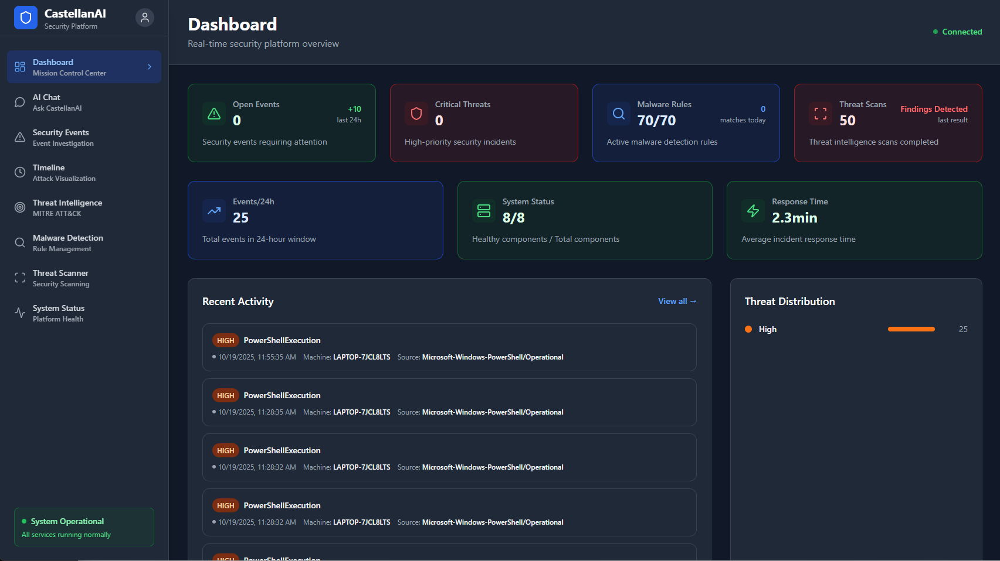
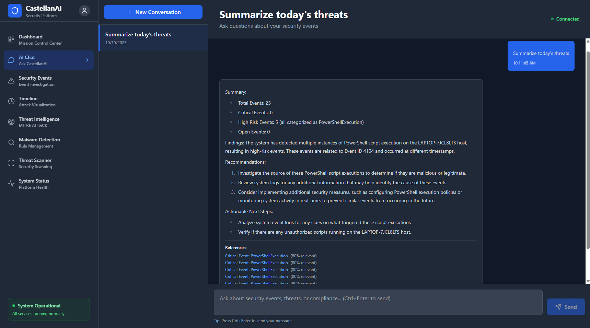
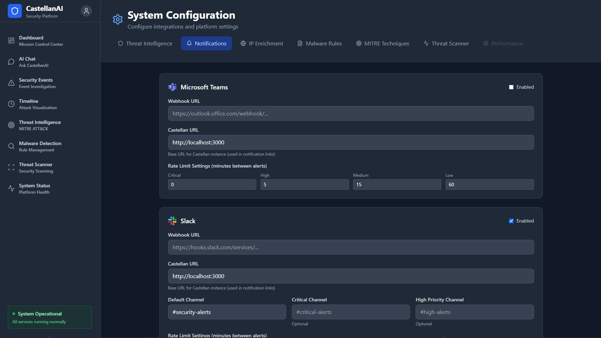

<p align="center">
    <picture>
        <source media="(prefers-color-scheme: dark)" srcset="assets/images/Castellan_light.png">
        <source media="(prefers-color-scheme: light)" srcset="assets/images/Castellan_dark.png">
        
    </picture>
</p>

<div align="center">


[](#-open-source--enterprise-grade)
[](https://dotnet.microsoft.com/)
[](https://www.microsoft.com/windows)
[](LICENSE)
[](https://openai.com/)
[](https://attack.mitre.org/)

**AI-Powered Windows Security Monitoring**

</div>

---

**CastellanAI** is a **100% open source**, enterprise-grade security monitoring platform that transforms Windows event logs into actionable security intelligence using AI-powered analysis, vector search, and real-time threat correlation.

**Enterprise Features**: 12K+ events/sec processing • Vector similarity search • Advanced correlation engine • Real-time Teams/Slack alerts • 800+ MITRE ATT&CK techniques • VirusTotal/MalwareBazaar integration • Complete YARA malware detection with auto-updates • Trend forecasting • Timeline visualization • Export capabilities • Centralized configuration management • Single consolidated database architecture

**2-Minute Setup**: 3 required fields → `.\scripts\start.ps1` → Open `http://localhost:3000` → Start monitoring

## Key Features

- **Conversational AI Chat** - Natural language security queries with context-aware responses and Markdown formatting
- **AI-Powered Analysis** - LLM-based threat classification with vector similarity search
- **Real-time Detection** - EventLogWatcher-powered live Windows Event Log monitoring with sub-second threat correlation
- **Advanced Correlation** - Attack chain detection, temporal bursts, lateral movement, and privilege escalation patterns
- **Enterprise Scale** - 12K+ events/sec processing with optimized performance
- **Smart Notifications** - Rich Teams/Slack alerts with adaptive rate limiting
- **MITRE Integration** - Auto-updated 800+ ATT&CK techniques with threat mapping
- **Threat Intelligence** - VirusTotal, MalwareBazaar, AlienVault OTX with configuration UI
- **Malware Detection** - Complete signature-based detection with automatic rule updates and deduplication
- **Threat Scanner** - On-demand Quick/Full scans with real-time progress tracking, scheduled scanning, quarantine management, and exclusions
- **Timeline Visualization** - Interactive security event timeline with granular analysis
- **Data Export** - CSV, JSON, PDF export with filtering and background processing
- **Enterprise Security** - BCrypt passwords, JWT tokens, audit trails

## Screenshots

<p align="center">
  
  <br><em>Real-time security monitoring dashboard with live threat intelligence</em>
</p>

<p align="center">
  
  <br><em>Natural language AI chat interface for conversational security analysis and threat investigation</em>
</p>

<p align="center">
  
  <br><em>Centralized notification settings for Microsoft Teams and Slack integration</em>
</p>

## Quick Start

### Prerequisites
- [.NET 8.0 SDK](https://dotnet.microsoft.com/download/dotnet/8.0) 
- [Docker](https://www.docker.com/get-started/) (for Qdrant)
- [Ollama](https://ollama.com/) or [OpenAI API key](https://platform.openai.com/api-keys)

### Installation

1. **Clone repository**
   ```powershell
   git clone https://github.com/MLidstrom/castellan.git
   cd castellan
   ```

2. **Configure authentication**
   ```powershell
   $env:AUTHENTICATION__JWT__SECRETKEY = "your-secure-jwt-secret-key-minimum-64-characters"
   $env:AUTHENTICATION__ADMINUSER__USERNAME = "admin"
   $env:AUTHENTICATION__ADMINUSER__PASSWORD = "your-secure-password"
   ```

3. **Install AI models** (if using Ollama)
   ```powershell
   ollama pull nomic-embed-text
   ollama pull llama3.1:8b-instruct-q8_0
   ```

4. **Start services**
   ```powershell
   .\scripts\start.ps1
   ```

5. **Access dashboard**: Open `http://localhost:3000`

> **⚠️ Security Note**: See [Configuration Setup](docs/CONFIGURATION_SETUP.md) for detailed setup instructions.

## Why CastellanAI?

### **Production-Ready Enterprise Platform**
- **AGPL-3.0 Licensed** - 100% open source with complete transparency and strong copyleft
- **2-Minute Setup** - Simplified configuration with only 3 required fields
- **Enterprise Scale** - 12K+ events/sec with snapshot caching for <50ms instant page loads
- **AI-First** - Vector search + LLM analysis built-in
- **Zero Vendor Lock-in** - Fork, modify, deploy anywhere

### **vs. Traditional SIEM Solutions**
| Feature | CastellanAI | Splunk/QRadar/ELK |
|---------|-----------|-------------------|
| **Deployment** | 2 minutes | Weeks to months |
| **AI/ML** | Built-in LLM + Vector | Add-on modules |
| **Customization** | Full source access | Vendor limited |
| **Cost** | Free + self-hosted | $$$$ + licensing |
| **Windows Focus** | Native optimization | Generic approach |

## Documentation

**[Complete Documentation Index](docs/README.md)** - Master documentation hub with organized access to all guides, features, and technical references.

### Quick Reference
| Topic | Description |
|-------|-------------|
| **[Quick Start Guide](docs/GETTING_STARTED.md)** | Complete installation and setup instructions |
| **[Features](docs/FEATURES.md)** | Comprehensive feature overview and capabilities |
| **[YARA Detection](docs/MALWARE_DETECTION.md)** | Signature-based malware detection and rule management |
| **[Configuration](docs/CONFIGURATION_SETUP.md)** | Authentication, AI providers, centralized settings management |
| **[Notifications](docs/NOTIFICATIONS.md)** | Teams/Slack integration via Configuration tab |
| **[Architecture](docs/ARCHITECTURE.md)** | System architecture, security, and observability |
| **[Performance](docs/PERFORMANCE.md)** | Performance metrics, benchmarks, and optimization |
| **[Troubleshooting](docs/TROUBLESHOOTING.md)** | Common issues and solutions |

> **For the complete documentation catalog** including API references, build guides, security features, integrations, and specialized guides, visit **[docs/README.md](docs/README.md)**.

## Community & Support

- **[GitHub Issues](https://github.com/MLidstrom/Castellan/issues)** - Bug reports and feature requests
- **[GitHub Discussions](https://github.com/MLidstrom/Castellan/discussions)** - Community support and questions  
- **[Contributing Guide](CONTRIBUTING.md)** - How to contribute to the project
- **[Security Policy](SECURITY.md)** - Security practices and responsible disclosure

## License

This project is licensed under the **GNU Affero General Public License v3.0 (AGPL-3.0)** - see the [LICENSE](LICENSE) file for details.

The AGPL-3.0 license ensures that any modifications to CastellanAI, including those used to provide network services, must be made available under the same license terms.

## Trademark Notice

The name **Castellan / CastellanAI** and the official logo are trademarks of Mats L. Canderfalk.
Forks and derivatives must not use the same name or branding in a way that suggests official support.

---

<div align="center">

**CastellanAI** - Your digital fortress guardian. 🏰

Built with ❤️ by the open source community

</div>
