# 🏰 Castellan: AI‑Powered Windows Security Monitoring

**Castellan** is an advanced security monitoring and threat detection platform that transforms Windows event logs into actionable security intelligence using AI-powered analysis, vector search, and real-time correlation. It also includes proactive threat scanning capabilities to detect malware and backdoors on your system.


> **Castellan** (noun): A governor or warden of a castle or fortification; a person responsible for the defense and security of a stronghold. From the medieval Latin *castellanus*, meaning "pertaining to a castle." The name reflects our mission to provide vigilant security monitoring and defense for your digital infrastructure. ([Source: Merriam-Webster](https://www.merriam-webster.com/dictionary/castellan))

[](https://dotnet.microsoft.com/)
[](LICENSE)
[](https://www.microsoft.com/windows)
[](https://openai.com/)
[](https://docker.com/)
[](https://attack.mitre.org/)

## 🚀 Features

### 🔍 **Intelligent Log Analysis**
- **Real-time Windows Event Log Collection** - Monitors security, application, and system events
- **AI-Powered Triage** - LLM-based event classification and prioritization
- **Vector Search** - Semantic similarity search using Qdrant vector database
- **Advanced Correlation** - M4 correlation engine for threat pattern detection

### 🛡️ **Security Detection**
- **Threat Intelligence** - IP reputation feeds and geolocation enrichment
- **MITRE ATT&CK Mapping** - Automatic threat technique classification
- **Anomaly Detection** - Machine learning-based behavioral analysis
- **Automated Response** - Real-time threat response with configurable actions

### 📊 **Monitoring & Analysis**
- **Security Event Correlation** - Pattern detection and event relationship analysis
- **Threat Pattern Recognition** - AI-powered identification of attack sequences
- **Performance Monitoring** - System health and security service status
- **Event Timeline** - Chronological security event tracking
- **Persistent Storage** - 24-hour rolling window with automatic restart recovery

### 🔔 **Notifications & Interface**
- **Desktop Notifications** - Real-time security alerts
- **Web Admin Interface** - React-based management dashboard
- **Local Deployment** - No cloud dependencies, runs entirely on your local infrastructure

### 🧪 **Quality & Testing**
- **Comprehensive Test Suite** - 375 tests with 95.7% success rate covering all critical functionality
- **Production Ready** - Robust error handling, advanced mocking, and comprehensive validation
- **Continuous Validation** - Automated testing for controllers, services, and integration scenarios

## 🏗️ Architecture

Castellan processes Windows security events through AI/ML analysis, stores enriched data in a vector database for correlation, and provides desktop and web interfaces for monitoring and response.

```mermaid
flowchart LR
    A[Windows Event Logs] --> B[Castellan Worker Service]
    B --> C[AI/ML Processing]
    C --> D[Qdrant Vector Database]
    B --> E[Notification Services]
    E --> F[Desktop Notifications]
    E --> G[Web Admin Interface]
    D --> H[Vector Search & Correlation]
    H --> I[Threat Detection Engine]
    I --> J[Security Alerts]
    J --> E
    
    subgraph "Data Collection"
        A
    end
    
    subgraph "Core Processing"
        B
        C
        D
    end
    
    subgraph "Intelligence & Analysis"
        H
        I
        J
    end
    
    subgraph "User Interface"
        F
        G
    end
    
    style A fill:#e1f5fe,color:#000
    style B fill:#f3e5f5,color:#000
    style C fill:#fff3e0,color:#000
    style D fill:#e8f5e8,color:#000
    style E fill:#fce4ec,color:#000
    style F fill:#f1f8e9,color:#000
    style G fill:#f1f8e9,color:#000
    style H fill:#fff8e1,color:#000
    style I fill:#ffebee,color:#000
    style J fill:#ffebee,color:#000
```



## 🚀 Quick Start

### Prerequisites
- **[.NET 8.0 SDK](https://dotnet.microsoft.com/download/dotnet/8.0)** or later
- **[Qdrant](https://qdrant.tech/)** (local [Docker](https://www.docker.com/get-started/))
- **AI Provider** ([Ollama](https://ollama.com/) or [OpenAI](https://openai.com/))
- **MaxMind GeoLite2 Databases** (optional but recommended for IP enrichment - see step 2 below)

### 1. Clone the Repository
```bash
git clone https://github.com/MLidstrom/castellan.git
cd castellan
```

### 2. Download MaxMind GeoLite2 Databases (Optional but Recommended)
For IP geolocation and enrichment features:
1. **Register for a free account** at https://www.maxmind.com/en/geolite2/signup
2. **Download databases** from https://www.maxmind.com/en/accounts/current/geoip/downloads:
   - GeoLite2 City (Binary/gzip)
   - GeoLite2 ASN (Binary/gzip)
   - GeoLite2 Country (Binary/gzip)
3. **Extract** the `.mmdb` files and place in `src/Castellan.Worker/data/`

**Note**: The application will run without these files, but IP enrichment will be disabled. See [detailed instructions](src/Castellan.Worker/data/README.md).

### 3. Configure Authentication
```powershell
# IMPORTANT: Copy template and configure your credentials
cd src\Castellan.Worker
Copy-Item appsettings.template.json appsettings.json

# Edit appsettings.json with your secure credentials
# Or use environment variables:
$env:AUTHENTICATION__JWT__SECRETKEY = "your-secure-jwt-secret-key-minimum-64-characters"
$env:AUTHENTICATION__ADMINUSER__USERNAME = "admin"
$env:AUTHENTICATION__ADMINUSER__PASSWORD = "your-secure-password"
```

**⚠️ Security Note:** See [CONFIGURATION_SETUP.md](docs/CONFIGURATION_SETUP.md) for detailed configuration instructions.

### 4. Configure AI Providers (Optional)
```powershell
# For OpenAI (if not using Ollama) - Get API key from https://platform.openai.com/api-keys
$env:OPENAI_API_KEY = "your-openai-key"
$env:EMBEDDINGS__PROVIDER = "OpenAI"
$env:LLM__PROVIDER = "OpenAI"
```

### 5. Install Ollama Models (if using local AI)
```powershell
# Install Ollama first from https://ollama.com/download
# Then pull the required models:
ollama pull nomic-embed-text    # Embedding model: https://ollama.com/library/nomic-embed-text
ollama pull llama3.1:8b-instruct-q8_0    # LLM model: https://ollama.com/library/llama3.1
```

### 6. Start All Services
```powershell
# Start everything (Worker handles all orchestration)
.\scripts\start.ps1

# Enhanced startup options:
.\scripts\start.ps1                    # Standard start with build
.\scripts\start.ps1 -NoBuild          # Skip build step
.\scripts\start.ps1 -Background       # Run in background
.\scripts\start.ps1 -NoBuild -Background  # Skip build + background

# Check service status:
.\scripts\status.ps1                  # Basic status check
.\scripts\status.ps1 -Detailed       # Detailed component info

# Stop all services:
.\scripts\stop.ps1                    # Graceful stop
.\scripts\stop.ps1 -Force            # Force stop all
.\scripts\stop.ps1 -KeepQdrant       # Stop but keep Qdrant running

# Run tests:
.\scripts\run-tests.ps1              # Run all tests
.\scripts\run-tests.ps1 -Verbosity detailed  # Verbose output
```

**What gets started automatically:**
- Qdrant vector database (Docker container)
- Castellan Worker service (main API on port 5000)
- React Admin interface (port 8080)
- System Tray application

**Alternative: Manual Start (Advanced Users)**
<details>
<summary>Click to see manual startup steps</summary>

```powershell
# Start Qdrant manually (requires Docker: https://www.docker.com/get-started/)
docker run -d --name qdrant -p 6333:6333 qdrant/qdrant

# Start Worker service (disable auto-start first)
cd src\Castellan.Worker
dotnet run

# Start React Admin (new terminal, requires Node.js: https://nodejs.org/)
cd castellan-admin
npm install
npm start
```

Note: Set `"Startup:AutoStart:Enabled": false` in appsettings.json for manual control.
</details>

### 7. Access Web Interface
Open your browser to `http://localhost:8080` to access the React admin interface.

**Note:** Use the credentials you configured in step 3 for authentication.

## 📦 License & Deployment

### 🌟 **Open Source**
- **License**: MIT License (full source code access)
- **Deployment**: Self-hosted, full control
- **Features**: Complete security monitoring platform
- **Support**: Community support via GitHub
- **Perfect for**: Developers, security researchers, organizations wanting full control

## 🔧 Configuration

### Environment Variables
```powershell
# Authentication Configuration (REQUIRED)
$env:AUTHENTICATION__JWT__SECRETKEY = "your-secure-jwt-secret-key-minimum-64-characters"
$env:AUTHENTICATION__ADMINUSER__USERNAME = "admin"
$env:AUTHENTICATION__ADMINUSER__PASSWORD = "your-secure-password"

# Qdrant Configuration (https://qdrant.tech/)
$env:QDRANT__HOST = "localhost"
$env:QDRANT__PORT = "6333"
$env:QDRANT__HTTPS = "false"
$env:QDRANT__APIKEY = "your-api-key"   # For Qdrant Cloud: https://cloud.qdrant.io/

# AI Provider Configuration
$env:EMBEDDINGS__PROVIDER = "Ollama"   # Ollama (https://ollama.com/) or OpenAI
$env:LLM__PROVIDER = "Ollama"          # Ollama (https://ollama.com/) or OpenAI
$env:OPENAI_API_KEY = "your-openai-key"   # Get from: https://platform.openai.com/api-keys

```

### Build
```powershell
# Build Castellan
dotnet build -c Release
```

## 📚 Documentation

### Getting Started
- **[Configuration Setup](docs/CONFIGURATION_SETUP.md)** - **START HERE** - Initial configuration required
- **[Authentication Setup](docs/AUTHENTICATION_SETUP.md)** - Security configuration and credential setup
- **[Getting Started](docs/GETTING_STARTED.md)** - Quick start guide for development
- **[Startup Configuration](docs/STARTUP_CONFIGURATION.md)** - Service orchestration and 
- **[Test Suite](src/Castellan.Tests/)** - Comprehensive test coverage with 375 tests (95.7% success rate)

### Development & Operations
- **[Windows Logging Hardening](scripts/enable-logging-hardening.md)** - Windows audit policy configuration guide
- **[Troubleshooting Guide](docs/TROUBLESHOOTING.md)** - Common issues and solutions

### Additional Resources
- **[Build Guide](docs/BUILD_GUIDE.md)** - Detailed build and deployment instructions
- **[Compliance Guide](docs/COMPLIANCE.md)** - Compliance framework implementation
- **[API Documentation](docs/API.md)** - REST API reference
- **[Configuration Guide](docs/CONFIGURATION.md)** - Advanced configuration options

## 🤝 Contributing

We welcome contributions! Please see our [Contributing Guidelines](CONTRIBUTING.md) for details.

### Development Setup
1. Fork the repository
2. Create a feature branch
3. Make your changes
4. Add tests
5. Submit a pull request

## 📄 License

This project is licensed under the MIT License - see the [LICENSE](LICENSE) file for details.

## 🆘 Support

- **Community Support**: [GitHub Discussions](https://github.com/MLidstrom/Castellan/discussions)
- **Bug Reports**: [GitHub Issues](https://github.com/MLidstrom/Castellan/issues)
- **Feature Requests**: [GitHub Issues](https://github.com/MLidstrom/Castellan/issues)

## 🙏 Acknowledgments

- **Qdrant** for the vector database
- **OpenAI** and **Ollama** for AI capabilities
- **Microsoft** for Windows Event Log integration
- **MITRE** for ATT&CK framework

---

**Castellan** - Your digital fortress guardian. 🏰🛡️
