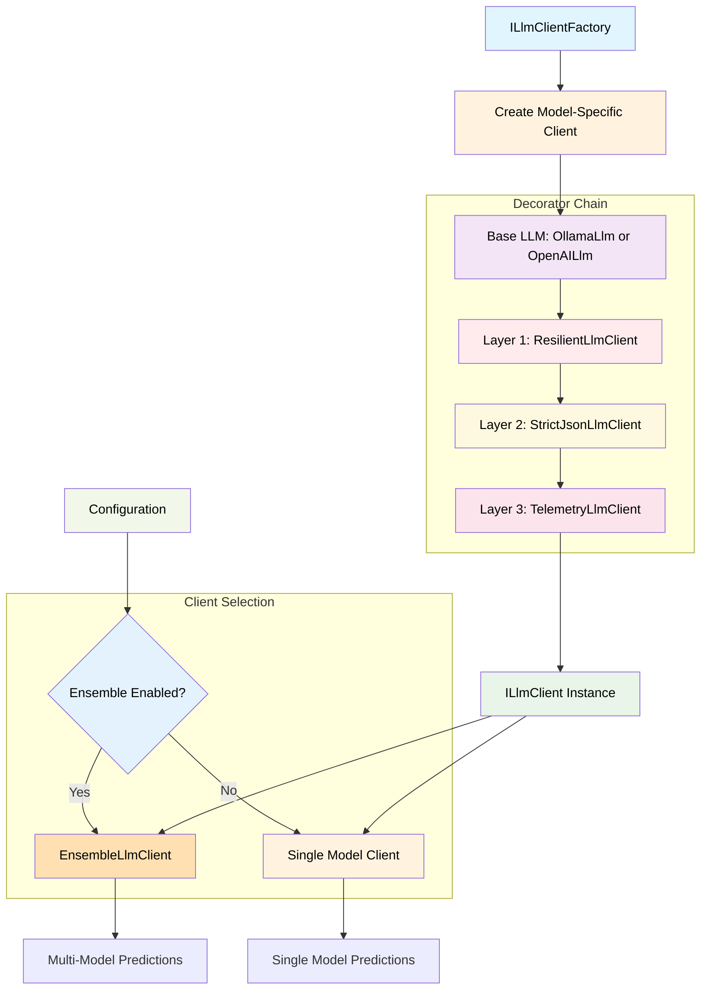
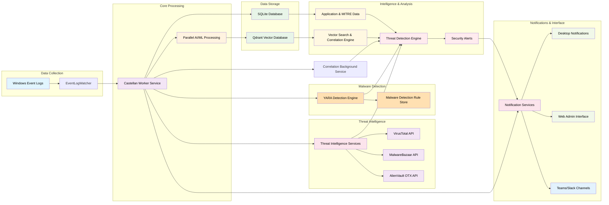

# Enterprise-Grade Architecture

## Overview

Castellan processes Windows security events through **enterprise-grade AI/ML analysis with comprehensive parallel processing, intelligent caching, and connection pooling**, stores enriched data in a vector database with scaling architecture, maintains application and MITRE data in SQLite, and provides multiple notification channels including desktop notifications, Teams/Slack integration, and a fully functional React Admin web interface.

## Current Enterprise Features (OPERATIONAL)

- **Connection Pooling**: 15-25% I/O optimization with health monitoring and automatic failover 🎆 **LIVE** - 2/2 instances healthy, HTTP monitoring active
- **Intelligent Caching**: 30-50% performance improvement with semantic similarity detection and memory management
- **🆕 AI Embedding Cache (v0.7.0)**: 30-70% reduction in embedding API calls with hash-keyed LRU cache and stampede prevention 🎆 **LIVE**
- **🆕 Polly Resilience Patterns (v0.7.0)**: Zero cascading failures with retry, circuit breaker, timeout - 97%+ reliability 🎆 **LIVE**
- **Scaling Architecture**: Complete horizontal scaling with load balancing, event queues, and auto-scaling
- **Pipeline Stability**: Production-ready with stable background operation and comprehensive monitoring
- **MITRE Integration**: Full ATT&CK framework integration with 50+ techniques displayed in web interface
- **Configuration Management**: Complete threat intelligence provider settings with persistent storage and real-time validation 🆕 **LIVE**
- **Background Service Management**: Reliable PowerShell job-based startup with comprehensive monitoring
- **🆕 Real-time Monitoring**: SignalR-powered live system health, scan progress, and threat intelligence status
- **🆕 Dashboard Data Consolidation**: Single SignalR stream replaces 4+ REST API calls with 80%+ performance improvement
- **🆕 Malware Detection**: Signature-based malware detection with comprehensive rule management and API
- **🆕 EventLogWatcher**: Real-time Windows Event Log monitoring with sub-second latency and zero event loss
- **🆕 Multi-Model Ensemble (v0.7.0)**: LLM factory pattern with support for parallel/sequential multi-model predictions 🎆 **READY**

## AI/ML Architecture (v0.7.0)

### LLM Factory Pattern

Castellan uses a sophisticated factory pattern for creating LLM client instances, enabling both single-model and multi-model ensemble predictions:

### AI/ML Components

- **LLM Factory Pattern**: Creates model-specific clients with full decorator chain (Base → Resilience → StrictJson → Telemetry)
- **Multi-Model Ensemble**: Supports calling multiple models (llama3.1, mistral, gemma2) with voting/aggregation strategies
- **Voting Strategies**: Majority voting (categorical fields), weighted voting, unanimous voting
- **Confidence Aggregation**: Mean, median, min, max, weighted_mean strategies for numerical fields
- **Graceful Degradation**: Multi-level fallback when models fail or don't reach quorum
- **Statistics Tracking**: Monitors model performance, success rates, failure counts, and response times
- **Embeddings**: Supports Ollama (nomic-embed-text) and OpenAI (text-embedding-3-small) with caching and resilience
- **Vector Search**: Qdrant integration for semantic similarity search and correlation detection
- **ML.NET Clustering**: Anomaly detection with 8-feature analysis for security event correlation

### Configuration

See `docs/FACTORY_PATTERN_IMPLEMENTATION.md` and `docs/ENSEMBLE_ARCHITECTURE.md` for detailed configuration guides.

## System Architecture Diagram

## Security Architecture

### Enterprise-Grade Authentication System

### Security Features

- **Password Security**: BCrypt hashing with configurable work factors (4-12 rounds)
- **Token Management**: JWT with secure refresh token rotation and automatic expiration
- **Token Blacklisting**: Real-time token revocation with in-memory cache and cleanup
- **Complexity Validation**: Enforced password strength requirements (length, character types)
- **Audit Trail**: Comprehensive authentication event logging for security monitoring
- **Session Security**: Automatic token expiration, renewal, and secure refresh handling
- **Multi-layered Defense**: Multiple security checks at authentication, authorization, and session levels
- **Request Tracing**: Every API request tracked with unique correlation IDs for security incident investigation
- **Configuration Safety**: Startup validation prevents deployment with invalid security configurations

## Observability & Reliability

### Enterprise-Grade Operations

### Reliability Features

- **Correlation Tracking**: Unique request IDs for complete request lifecycle tracing
- **Structured Logging**: JSON-formatted logs with contextual information for analysis
- **Global Exception Handling**: Consistent error responses across all API endpoints
- **Service Validation**: Startup checks ensure all critical services are properly configured
- **Configuration Validation**: Prevents deployment with invalid system configurations
- **Performance Monitoring**: Request duration tracking and service health metrics
- **Fail-Fast Architecture**: Application stops startup on critical configuration errors
- **Request Context**: Complete request information available for debugging and security analysis

## Data Storage

### Qdrant Vector Database
- **Purpose**: AI/ML embeddings and vector similarity search
- **Data**: Event embeddings, semantic search, ML.NET correlation models
- **Location**: Docker container (localhost:6333)

### SQLite Database
- **Purpose**: Application metadata and MITRE ATT&CK techniques
- **Data**: Application inventory, security configurations, MITRE techniques, security event persistence, correlation data
- **Location**: `src/Castellan.Worker/data/castellan.db` (automatically created)
- **Schema**: Applications, MITRE techniques, security events with correlation fields, system configuration
